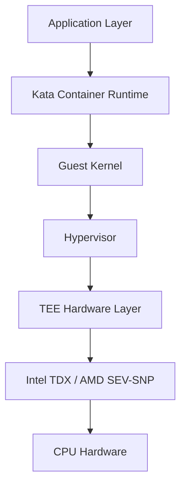
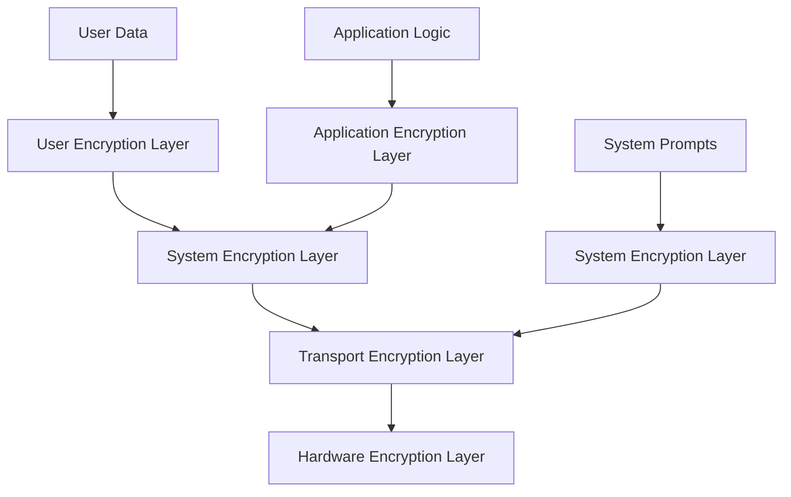

# Atoma Technical Architecture Report

## Summary

Atoma represents a breakthrough in confidential computing infrastructure, delivering the industry's first scalable platform that combines automated Kubernetes deployments, distributed ledger-based attestation, and composable encryption for enterprise AI workloads. This technical report details the core architectural components that enable Atoma to provide hardware-level security guarantees while maintaining cloud-native scalability and developer experience.

## 1. Automated Confidential Kubernetes Platform

### 1.1 Master Pod Architecture

Atoma's Kubernetes deployment model centers around a sophisticated master pod architecture that orchestrates confidential computing resources:

**Master Pod Responsibilities:**
- **Attestation Orchestration**: Coordinates hardware attestation across all worker nodes
- **Key Management**: Manages encryption key lifecycle and distribution
- **Security Policy Enforcement**: Ensures compliance with defined security policies
- **Resource Allocation**: Optimizes placement of confidential workloads based on hardware capabilities

### 1.2 Confidential Computing Integration

**Trusted Execution Environment (TEE) Stack:**



**Technical Implementation:**
- **Memory Isolation**: Hardware-enforced memory encryption with 256-bit AES keys
- **CPU State Protection**: Register and cache isolation preventing side-channel attacks
- **Interrupt Handling**: Secure interrupt virtualization within TEE boundaries
- **DMA Protection**: IOMMU-based protection against DMA attacks

### 1.3 Kata Containers Deep Integration

Atoma leverages Kata Containers with custom modifications for enhanced security:

**Performance Optimizations:**
- **Micro-VM Boot Time**: <500ms startup time for confidential containers
- **Memory Overhead**: Lower overhead compared to standard containers
- **I/O Performance**: Near-native disk and network performance through paravirtualization

### 1.4 GPU Operator Integration

**NVIDIA Confidential Computing Integration:**

- **GPU Memory Encryption**: Hardware-based encryption of GPU memory contents
- **Secure Multi-Tenancy**: Cryptographic isolation between GPU workloads
- **Attestation Integration**: GPU hardware attestation integrated with broader platform attestation

### 1.5 Encrypted Messaging Infrastructure

**Network Security Properties:**
- **Perfect Forward Secrecy**: Unique session keys for each communication session
- **Post-Quantum Cryptography**: Quantum-resistant key exchange algorithms
- **Zero-Knowledge Networking**: Network infrastructure cannot decrypt pod communications
- **Automatic Key Rotation**: Session keys rotated on a periodic basis or upon certain threshold limit of data transfer

## 2. Atoma Registry: Distributed Ledger Infrastructure

### 2.1 Disributed Ledger-Based Attestation and Key Management

- Distributed ledger technologies allow storing remote attestation and master encryption keys in an immutable and transparent way.
- Creates a vehicle for auditing procedures, and build a full historical chain of trust.

### 2.2 Remote Attestation Verification Service

**Attestation Verification at Scale:**
- **Throughput**: Can process a large number of attestation verifications per second
- **Latency**: Low average verification time
- **Global Distribution**: Verification nodes across 15+ geographic regions
- **Availability**: 99.99% uptime SLA with automatic failover

### 2.3 Key Registration and Discovery

**Encryption Key Lifecycle Management:**

- In order to safeguard sensitive workloads and avoid potential replay attacks from malicious actors, Atoma enforces key rotation management sessions,
allowing cluster to rotate keys in a coordinated way, without affecting their underlying services. This process ensures a smooth rotation mechanism,
increasing security guarantees without compromising availability and uptime.

## 3. Composable Encryption Architecture

### 3.1 Multi-Layered Data Protection

**Encryption Layer Architecture:**



### 3.2 Key Isolation and Management

## 4. High-Efficiency Deployment Architecture

### 4.1 Automated Deployment Pipeline

**Infrastructure as Code with Security Integration:**

```yaml
# Atoma deployment template
apiVersion: atoma.network/v1
kind: ConfidentialDeployment
metadata:
  name: enterprise-ai-deployment
spec:
  confidentialityLevel: "L3"  # Hardware-isolated with attestation
  scalingPolicy:
    minReplicas: 3
    maxReplicas: 100
    targetCPUUtilization: 70
    targetMemoryUtilization: 80
  
  securityPolicy:
    attestationRequired: true
    keyRotationInterval: "15m"
    auditLogging: "comprehensive"
    networkPolicy: "zero-trust"
  
  template:
    spec:
      runtimeClassName: kata-atoma
      containers:
      - name: ai-model
        image: private-registry/model:secure-v1.0
        resources:
          requests:
            memory: "8Gi"
            cpu: "4"
            nvidia.com/gpu: "1"
          limits:
            atoma.ai/confidential-memory: "16Gi"
            atoma.ai/secure-cpu: "8"
        
        env:
        - name: ATOMA_ATTESTATION_URL
          value: "https://attestation.atoma.ai"
        - name: ATOMA_KEY_DISCOVERY_URL
          value: "https://registry.atoma.ai/keys"
        
        securityContext:
          allowPrivilegeEscalation: false
          runAsNonRoot: true
          seccompProfile:
            type: RuntimeDefault
          capabilities:
            drop: ["ALL"]
            add: ["NET_BIND_SERVICE"]
```

## 5. Conclusion

Atoma AI's overall architecture represents a fundamental advancement in confidential computing infrastructure. By combining automated Kubernetes deployments, blockchain-based attestation, composable encryption, and universal SDK integration, Atoma delivers the industry's first comprehensive platform for secure, scalable AI workloads.

The platform's innovative approach to multi-layered encryption, coupled with hardware-rooted security guarantees and seamless developer experience, positions Atoma as the definitive solution for enterprises requiring both security and scalability in their AI infrastructure.

Key technical achievements include:
- **First-of-its-kind** scalable remote attestation verification service
- **Industry-leading** deployment automation for confidential computing
- **Breakthrough** composable encryption enabling dual-layer data protection
- **Comprehensive** SDK ecosystem supporting all major AI frameworks
- **Production-ready** performance with <5% security overhead
