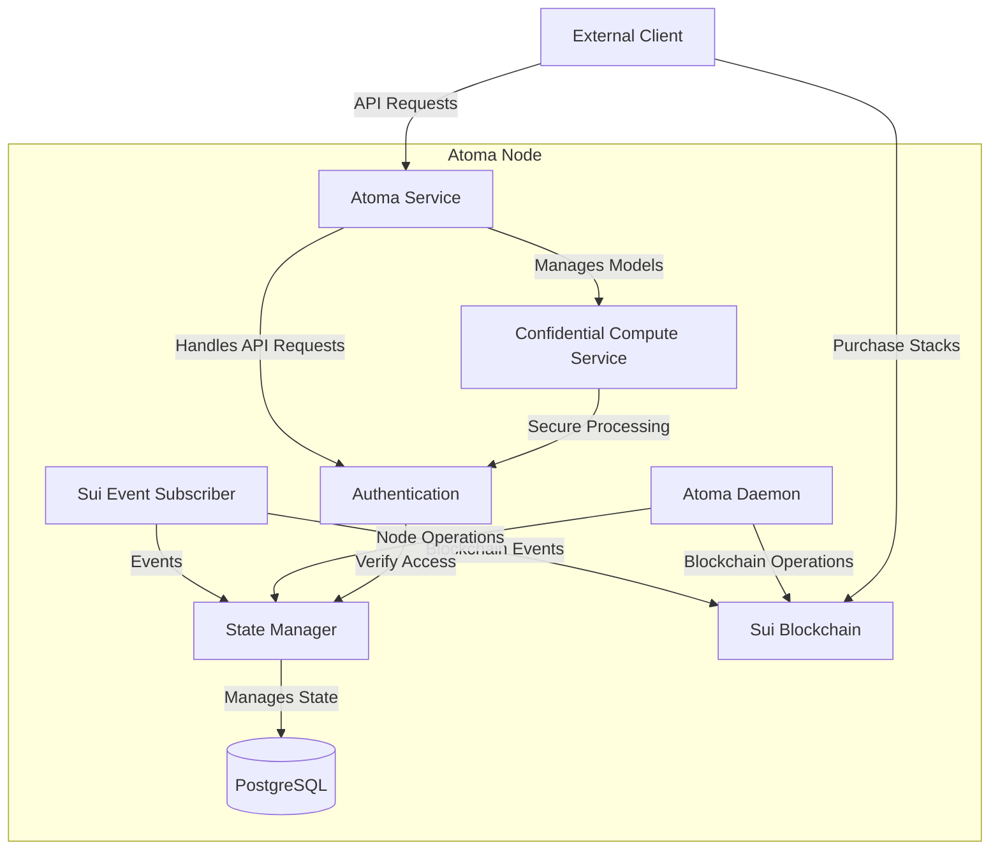

## Component Overview

### Core Components

1. **Atoma Service**
   - Main entry point for client requests
   - Handles API endpoints for inference, embeddings, and image generation
   - Manages request routing and response handling
   - Integrates with external AI services

2. **State Manager**
   - Maintains node state and synchronization
   - Manages database operations
   - Handles task queuing and execution
   - Tracks compute units and settlements

3. **Sui Event Subscriber**
   - Listens to blockchain events
   - Processes on-chain state changes
   - Manages node registration and task assignments
   - Handles settlement verification

4. **Confidential Compute Service**
   - Provides secure enclave operations
   - Manages encryption/decryption of sensitive data
   - Ensures privacy guarantees for compute tasks
   - Handles attestation proofs

5. **Atoma Daemon**
   - Manages node operations and maintenance
   - Handles node registration and subscriptions
   - Processes stack settlements
   - Manages node rewards and claims

### Supporting Components

6. **Authentication**
   - Verifies client requests
   - Manages cryptographic signatures
   - Handles access control
   - Integrates with Sui wallet

7. **Sui Client**
   - Interfaces with Sui blockchain
   - Manages transaction submissions
   - Handles smart contract interactions
   - Processes blockchain events

### External Integrations

8. **AI Services**
   - Inference Service: Handles LLM inference requests
   - Embeddings Service: Processes text embedding operations
   - Image Generation Service: Manages image generation tasks

9. **Database**
   - Stores node state and configuration
   - Maintains task and compute records
   - Tracks settlements and disputes
   - Manages node subscriptions

This architecture ensures secure, scalable, and verifiable AI compute operations while maintaining decentralization through blockchain integration and confidential computing capabilities.